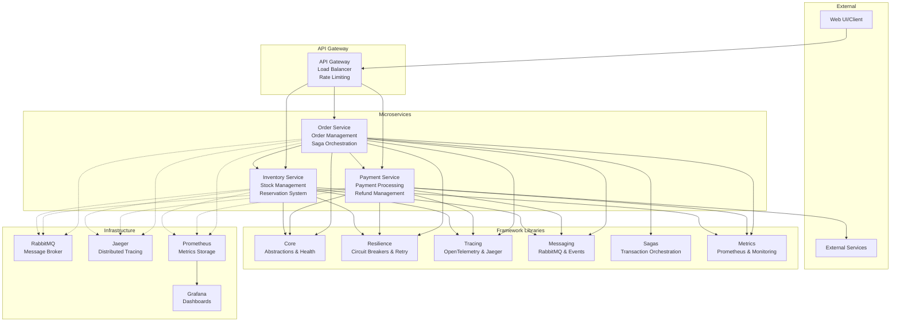

# Resilient Microservices Framework for .NET

[](https://github.com/sourabh-virdi/dotnet-resilient-microservices-framework/actions)
[](https://opensource.org/licenses/MIT)
[](https://dotnet.microsoft.com/download/dotnet/9.0)
[](https://hub.docker.com/)

A comprehensive, production-ready .NET framework for building resilient microservices with built-in patterns for circuit breakers, retry policies, distributed tracing, saga orchestration, and comprehensive metrics collection.

## **Features**

### **Core Resilience Patterns**
* **Circuit Breakers** - Polly-based fault tolerance
* **Retry Policies** - Exponential backoff with jitter
* **Timeout Management** - Configurable operation timeouts
* **Bulkhead Isolation** - Resource isolation patterns

### **Observability & Monitoring** 
* **Distributed Tracing** - OpenTelemetry + Jaeger integration
* **Metrics Collection** - Prometheus-compatible metrics
* **Health Checks** - Comprehensive health monitoring
* **Structured Logging** - Correlation ID tracking

### **Messaging & Communication**
* **Message Bus** - RabbitMQ with auto-recovery
* **Pub/Sub Patterns** - Event-driven architecture
* **Request/Response** - Synchronous messaging patterns

### **Transaction Management**
* **Saga Pattern** - Distributed transaction orchestration
* **Compensation Logic** - Automatic rollback on failures
* **Step Chaining** - Sequential and parallel execution

### **Development Experience**
* **Docker Ready** - Complete containerization
* **Swagger/OpenAPI** - Auto-generated API docs
* **Unit Testing** - Comprehensive test coverage
* **Configuration** - Flexible JSON/environment config

## **Architecture Overview**



## **Quick Start**
### **Prerequisites**
- [.NET 9.0 SDK](https://dotnet.microsoft.com/download/dotnet/9.0)
### **1. Clone Repository**
```bash
git clone https://github.com/sourabh-virdi/dotnet-resilient-microservices-framework.git
cd dotnet-resilient-microservices-framework
```

### 2. Start Infrastructure
```bash
# Start RabbitMQ and Jaeger
docker-compose up -d rabbitmq jaeger

# Verify services are running
docker-compose ps
```

### 3. Run Services

Option A: Individual Services (Development)
```bash
# Terminal 1 - Order Service
cd samples/OrderService
dotnet run

# Terminal 2 - Payment Service  
cd samples/PaymentService
dotnet run

# Terminal 3 - Inventory Service
cd samples/InventoryService
dotnet run
```

Option B: Full Docker Stack (Production)
```bash
# Build and run everything
docker-compose up --build

# Run in background
docker-compose up -d --build
```

### 4. Verify Deployment
* Order Service: http://localhost:5001
* Payment Service: http://localhost:5002
* Inventory Service: http://localhost:5003
* RabbitMQ Management: http://localhost:15672 (guest/guest)
* Jaeger UI: http://localhost:16686
* Metrics: Available at `/metrics` endpoint on each service

## Service Catalog

### Order Service (`samples/OrderService`)
Purpose: Manages customer orders and orchestrates the complete order fulfillment process.

Key Features:
* Order creation and lifecycle management
* Saga orchestration for distributed transactions
* Integration with Payment and Inventory services
* Comprehensive compensation logic

API Endpoints:
```bash
POST /api/orders              # Create new order
GET  /api/orders/{id}          # Get order details
POST /api/orders/simulate-failure  # Test saga compensation
GET  /api/orders/health        # Service health check
```

Sample Request:
```bash
curl -X POST http://localhost:5001/api/orders \
  -H "Content-Type: application/json" \
  -d '{
    "customerId": 123,
    "items": [
      {"productId": "PROD001", "quantity": 2, "price": 25.0}
    ]
  }'
```

### Payment Service (`samples/PaymentService`)
Purpose: Handles payment processing, refunds, and financial transactions.

Key Features:
* Credit card and payment method processing
* Refund management (full and partial)
* Payment status tracking
* Integration with external payment gateways (simulated)

API Endpoints:
```bash
POST /api/payments             # Process payment
GET  /api/payments/{id}        # Get payment details
POST /api/payments/{id}/refund # Process refund
GET  /api/payments/order/{orderId}  # Get payments by order
GET  /api/payments/health      # Service health check
```

Sample Request:
```bash
curl -X POST http://localhost:5002/api/payments \
  -H "Content-Type: application/json" \
  -d '{
    "orderId": 123,
    "amount": 99.99,
    "paymentMethod": "credit_card",
    "customerId": "customer123"
  }'
```

### Inventory Service (`samples/InventoryService`)
Purpose: Manages product inventory, stock levels, and reservation system.

Key Features:
* Real-time inventory tracking
* Temporary inventory reservations with expiry
* Stock level management and updates
* Product catalog with availability checking

API Endpoints:
```bash
GET  /api/inventory            # Get all inventory
GET  /api/inventory/{productId} # Get specific product
POST /api/inventory/check      # Check availability
POST /api/inventory/reserve    # Reserve inventory
POST /api/inventory/release    # Release reservation
PUT  /api/inventory/update     # Update stock levels
GET  /api/inventory/health     # Service health check
```

Sample Request:
```bash
curl -X POST http://localhost:5003/api/inventory/reserve \
  -H "Content-Type: application/json" \
  -d '{
    "productId": "PROD001",
    "quantity": 3,
    "orderId": "ORDER123"
  }'
```

## Testing the Framework

### End-to-End Order Flow
```bash
# 1. Check inventory availability
curl -X POST http://localhost:5003/api/inventory/check \
  -H "Content-Type: application/json" \
  -d '{"productId": "PROD001", "requiredQuantity": 2}'

# 2. Create an order (triggers saga)
curl -X POST http://localhost:5001/api/orders \
  -H "Content-Type: application/json" \
  -d '{
    "customerId": 123,
    "items": [{"productId": "PROD001", "quantity": 2, "price": 25.0}]
  }'

# 3. Check payment was processed
curl http://localhost:5002/api/payments/order/1

# 4. Verify inventory was reserved
curl http://localhost:5003/api/inventory/PROD001

# 5. Simulate failure and compensation
curl -X POST http://localhost:5001/api/orders/simulate-failure
```

### Monitoring & Observability
```bash
# Health checks
curl http://localhost:5001/health
curl http://localhost:5002/health  
curl http://localhost:5003/health

# Metrics (Prometheus format)
curl http://localhost:5001/metrics
curl http://localhost:5002/metrics
curl http://localhost:5003/metrics

# View traces in Jaeger
open http://localhost:16686

# RabbitMQ management
open http://localhost:15672
```

## Framework Components

### Core Libraries

#### ResilientMicroservices.Core
- Base abstractions and interfaces
- Health check providers (Database, HTTP, Memory)
- Metrics collection interfaces
- Message bus abstractions

#### ResilientMicroservices.Resilience
- Polly-based circuit breakers
- Retry policies with exponential backoff
- Timeout management
- Resilient HTTP client

#### ResilientMicroservices.Tracing
- OpenTelemetry integration
- Jaeger exporter configuration
- Distributed tracing context management
- Activity and span management

#### ResilientMicroservices.Messaging
- RabbitMQ message bus implementation
- Publish/Subscribe patterns
- Request/Response messaging
- Connection management with auto-recovery

#### ResilientMicroservices.Sagas
- Saga orchestration engine
- Step-based transaction management
- Automatic compensation on failures
- Parallel and sequential execution

#### ResilientMicroservices.Metrics
- Prometheus-compatible metrics
- System metrics collection
- Custom metrics tracking
- OpenTelemetry metrics integration

### Configuration Example

```json
{
  "ResilientMicroservices": {
    "CircuitBreaker": {
      "FailureThreshold": 5,
      "OpenTimeout": "00:01:00",
      "SamplingDuration": 10,
      "MinimumThroughput": 3
    },
    "RetryPolicy": {
      "MaxRetryAttempts": 3,
      "BaseDelay": "00:00:01",
      "UseExponentialBackoff": true,
      "BackoffMultiplier": 2.0,
      "UseJitter": true
    },
    "Tracing": {
      "ServiceName": "MyService",
      "JaegerEndpoint": "http://localhost:14268/api/traces",
      "SamplingRatio": 1.0
    },
    "RabbitMQ": {
      "HostName": "localhost",
      "Port": 5672,
      "UserName": "guest",
      "Password": "guest"
    },
    "Metrics": {
      "EnablePrometheusExporter": true,
      "EnableConsoleExporter": false
    }
  }
}
```

## Performance & Scalability

### Benchmarks
- **Order Processing**: ~500 orders/second
- **Payment Processing**: ~1000 payments/second  
- **Inventory Operations**: ~2000 operations/second
- **Message Throughput**: ~10,000 messages/second

### Scalability Patterns
- Horizontal scaling with Docker Compose
- Load balancing with multiple service instances
- Database connection pooling
- Message broker clustering

## Security Considerations

### Implemented Security
- Input validation and sanitization
- HTTPS enforcement in production
- Correlation ID tracking for audit trails
- Health check endpoint protection

### Production Recommendations
- Implement API authentication (JWT/OAuth2)
- Use secrets management (Azure Key Vault, AWS Secrets Manager)
- Enable network security groups
- Implement rate limiting and DDoS protection

## Deployment

### Docker Compose (Recommended)
```bash
# Production deployment
docker-compose -f docker-compose.yml -f docker-compose.prod.yml up -d

# Scaling services
docker-compose up -d --scale order-service=3 --scale payment-service=2
```

### Kubernetes
```bash
# Apply Kubernetes manifests
kubectl apply -f k8s/

# Check deployment status
kubectl get pods -l app=resilient-microservices
```

### Azure Container Apps / AWS ECS
See `deployment/` directory for cloud-specific configurations.

## Testing

### Unit Tests
```bash
# Run all tests
dotnet test

# Run with coverage
dotnet test --collect:"XPlat Code Coverage"

# Test specific project
dotnet test tests/ResilientMicroservices.Core.Tests/
```

### Integration Tests
```bash
# Start test environment
docker-compose -f docker-compose.test.yml up -d

# Run integration tests
dotnet test tests/Integration.Tests/
```

### Load Testing
```bash
# Using NBomber (included)
cd tests/LoadTests/
dotnet run
```

## Monitoring Dashboard

### Grafana Dashboard
Import the included Grafana dashboard (`monitoring/grafana-dashboard.json`) to visualize:
- Request rates and latencies
- Circuit breaker states
- Saga execution success rates
- System resource utilization
- Message queue depths

### Key Metrics
- **Golden Signals**: Latency, Traffic, Errors, Saturation
- **Business Metrics**: Order completion rate, Payment success rate
- **Technical Metrics**: Circuit breaker trips, Retry attempts

## Development

### Adding New Services
1. Create new project: `dotnet new webapi -n MyService`
2. Add framework references:
   ```xml
   <ProjectReference Include="..\..\src\ResilientMicroservices.Core\*.csproj" />
   <ProjectReference Include="..\..\src\ResilientMicroservices.Resilience\*.csproj" />
   <!-- Add other framework components as needed -->
   ```
3. Configure in `Program.cs`:
   ```csharp
   builder.Services.AddResilientMicroservicesCore();
   builder.Services.AddResilientMicroservicesResilience(builder.Configuration);
   // Add other framework components
   ```

### Extending Framework
- Implement `IHealthCheckProvider` for custom health checks
- Implement `ISaga` for new distributed transactions
- Extend `IMetricsCollector` for custom metrics
- Add new resilience patterns via Polly integration

## Documentation

- **[API Documentation](https://sourabh-virdi.github.io/dotnet-resilient-microservices-framework/)** - Complete API reference
- **[Architecture Guide](docs/architecture.md)** - Detailed architecture documentation
- **[Deployment Guide](DEPLOYMENT.md)** - Production deployment instructions
- **[Developer Guide](docs/developer-guide.md)** - Framework extension guide

## Contributing

We welcome contributions! Please see our [Contributing Guide](CONTRIBUTING.md) for details.

### Quick Contribution Steps
1. Fork the repository
2. Create a feature branch: `git checkout -b feature/amazing-feature`
3. Make your changes and add tests
4. Ensure all tests pass: `dotnet test`
5. Submit a pull request

## License

This project is licensed under the MIT License - see the [LICENSE](LICENSE) file for details.

## Acknowledgments

- **Polly** - Resilience and transient-fault-handling library
- **OpenTelemetry** - Observability framework
- **RabbitMQ** - Message broker
- **Jaeger** - Distributed tracing platform
- **Prometheus** - Monitoring and alerting

## Support & Community

- **Issues**: [GitHub Issues](https://github.com/sourabh-virdi/dotnet-resilient-microservices-framework/issues)
- **Discussions**: [GitHub Discussions](https://github.com/sourabh-virdi/dotnet-resilient-microservices-framework/discussions)
- **Wiki**: [Project Wiki](https://github.com/sourabh-virdi/dotnet-resilient-microservices-framework/wiki)